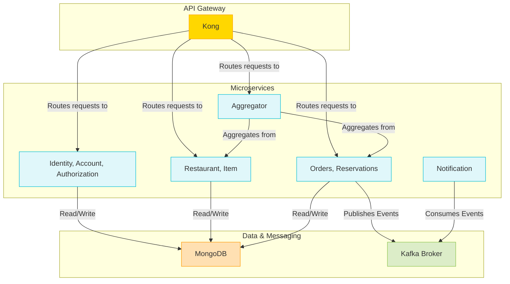

# Sabores Conectados

## Arquitetura



## Pré-requisitos

Antes de começar, certifique-se de ter os seguintes softwares instalados:

- Java 21
- Gradle
- Docker
- Docker Compose
- Taskfile

## Configuração

1. **Clone o repositório:**

   ```bash
   git clone <url-do-repositorio>
   cd sabores-conectados-microservices
   ```

2. **Variáveis de Ambiente:**

   O projeto usa variáveis de ambiente para configurar a conexão com o banco de dados e outros parâmetros. Crie um
   arquivo `dev.env` na raiz do projeto. Ele deve conter as seguintes variáveis:

   ```env
   DB_CONNECTION_STRING=
   MONGO_ROOT_USER=
   MONGO_ROOT_PASSWORD=
   MONGO_USER=
   MONGO_PASSWORD=
   KAFKA_HOST=broker:9092
   GATEWAY_HOST=http://kong:8000
   GATEWAY_IDENTITY_ROUTE=/api/identity
   GATEWAY_RESTAURANT_ROUTE=/api/restaurant
   GATEWAY_ORDER_ROUTE=/api/order
   GATEWAY_RESERVATION_ROUTE=/api/reservation
   GATEWAY_ITEM_ROUTE=/api/item
   TOKEN_URI=http://kong:8000/oauth2/token
   ACCOUNT_SERVICE_CLIENT_ID=
   ACCOUNT_SERVICE_CLIENT_SECRET=
   ORDER_SERVICE_CLIENT_ID=
   ORDER_SERVICE_CLIENT_SECRET=
   RESERVATION_SERVICE_CLIENT_ID=
   RESERVATION_SERVICE_CLIENT_SECRET=
   AGGREGATOR_SERVICE_CLIENT_ID=
   AGGREGATOR_SERVICE_CLIENT_SECRET=
   ```

## Executando a Aplicação

Para construir e iniciar todos os serviços, execute o seguinte comando na raiz do projeto:

```bash
task build
```

```bash
task up
```

Isso irá construir as imagens Docker para cada serviço e iniciá-los.

## Serviços

Abaixo está a lista de serviços e suas respectivas portas:

| Serviço                 | Porta Interna | Porta Externa | Rota no Gateway |
| ----------------------- | ------------- | ------------- |------------|
| Kong (Proxy)            | 8000          | 8000          | -          |
| Kong (Admin)            | 8001          | 8001          | -          |
| authorization-service   | 8080          | -             | /          |
| identity-service        | 8081          | -             | /api/identity |
| account-service         | 8082          | -             | /api/account |
| restaurant-service      | 8083          | -             | /api/restaurant |
| item-service            | 8084          | -             | /api/item  |
| order-service           | 8085          | -             | /api/order |
| reservation-service     | 8086          | -             | /api/reservation |
| aggregator-service      | 8087          | -             | /api/aggregator |
| notification-service    | 8088          | -             | -          |
| Kafka (Broker)          | 9092          | 9092          | -          |
| MongoDB                 | 27017         | 27017         | -          |

As requisições para os serviços devem ser feitas através do API Gateway (Kong) na porta `8000`.
